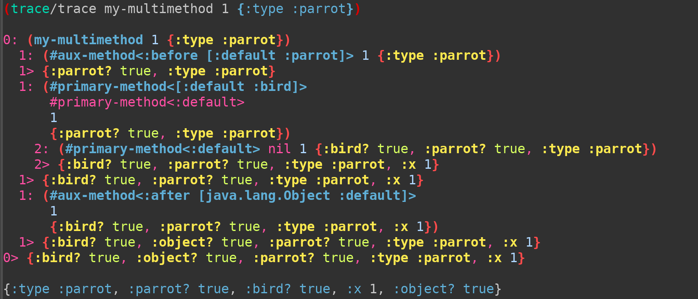

[](https://versions.deps.co/camsaul/methodical)
[](https://versions.deps.co/camsaul/methodical)
[](https://circleci.com/gh/camsaul/methodical)
[](https://codecov.io/gh/camsaul/methodical)
[](https://raw.githubusercontent.com/camsaul/methodical/master/LICENSE)
[](https://cljdoc.org/d/methodical/methodical/CURRENT)

[](http://clojars.org/methodical)

#### New: The Clojure/north 2020 talk is up!

[](https://youtu.be/If3GT8zSHfE)

# Methodical


Methodical is a library that provides drop-in replacements for Clojure multimethods and adds several advanced features.

```clj
(require '[methodical.core :as m])

(m/defmulti my-multimethod
  :type)

(m/defmethod my-multimethod Object
  [m]
  (assoc m :object? true))

(my-multimethod {:type Object})
;; -> {:type java.lang.Object, :object? true}
```

## Calling the next-most-specific method with `next-method`

Inspired by the Common Lisp Object System (CLOS), Methodical methods can call the next-most-specific method, if they
should so desire, by calling `next-method`:

```clj
(m/defmethod my-multimethod String
  [m]
  (next-method (assoc m :string? true)))

(my-multimethod {:type String})
;; -> {:type java.lang.String, :string? true, :object? true}
```

This makes it easy to reuse shared parent implementations of methods without having to know the exact dispatch value of the
next method. In vanilla Clojure multimethods, you'd have to do something like this:

```clj
((get-method my-multimethod Object) (assoc m :string? true))
```

If you're not sure whether a `next-method` exists, you can check whether it's `nil` before calling it.


## Auxiliary Methods: `:before`, `:after`, and `:around`

Inspired by the CLOS, Methodical multimethods support both *primary methods* and *auxiliary methods*. Primary methods
are the main methods that are invoked for a given dispatch value, such as the implementations for `String` or `Object`
in the examples above; they are the same type of method vanilla `defmethod` supports. Auxiliary methods are additional
methods that are invoked `:before`, `:after`, or `:around` the primary methods:

```clj
(m/defmethod my-multimethod :before String
  [m]
  (assoc m :before? true))

(m/defmethod my-multimethod :around String
  [m]
  (next-method (assoc m :around? true)))

(my-multimethod {:type String})
;; -> {:type java.lang.String, :around? true, :before? true, :string? true, :object? true}
```

#### `:before` methods

All applicable `:before` methods are invoked *before* the primary method, in order from most-specific (String before
Object) to least-specific. Unlike the CLOS, which ignores the results of `:before` and `:after` auxiliary methods, by
default Methodical threads the result of each `:before` method into the next method as its *last* argument. This better
supports Clojure's functional programming style.

```clj
(m/defmulti before-example
  (fn [x acc]
    (:type x)))

(m/defmethod before-example :before String
  [x acc]
  (conj acc :string))

(m/defmethod before-example :before Object
  [x acc]
  (conj acc :object))

(m/defmethod before-example :default
  [x acc]
  (conj acc :default))

(before-example {:type String} [])
;; -> [:string :object :default]
```

`:before` methods unlock a whole new range of solutions that would be tedious with vanilla Clojure multimethods:
suppose you wanted add logging to all invocations of a multimethod. With vanilla multimethods, you'd have to add an
individual log statment to every method! With Methodical, just add a new `:default` `:before` method:

```clj
(m/defmethod my-multimethod :before :default
  [& args]
  (log/debugf "my-multimethod called with args: %s" args)
  ;; return last arg so it is threaded thru for next method
  (last args))
```

#### `:after` methods

All applicable `:after` methods are invoked after the primary method, in order from least-specific (Object before
String) to most-specific. Like `:before` methods, (by default) the result of the previous method is threaded thru as
the last argument of the next function:

```clj
(m/defmulti after-example
  (fn [x acc]
    (:type x)))

(m/defmethod after-example :after String
  [x acc]
  (conj acc :string))

(m/defmethod after-example :after Object
  [x acc]
  (conj acc :object))

(m/defmethod after-example :default
  [x acc]
  (conj acc :default))

(after-example {:type String} [])
;; -> [:default :object :string]
```

#### `:around` methods

`:around` methods are called around all other methods and give you the power to choose how or when to invoke those
methods, and modify any arguments passed to them, or their result, as needed. Like primary methods (but unlike
`:before` and `:after` methods), `:around` methods have an implicit `next-method` argument; you'll need to call this to invoke
the next method. `:around` methods are invoked from least-specific to most-specific (Object before String):

```clj
(m/defmulti around-example
  (fn [x acc]
    (:type x)))

(m/defmethod around-example :around String
  [x acc]
  (as-> acc acc
    (conj acc :string-before)
    (next-method x acc)
    (conj acc :string-after)))

(m/defmethod around-example :around Object
  [x acc]
  (as-> acc acc
    (conj acc :object-before)
    (next-method x acc)
    (conj acc :object-after)))

(m/defmethod around-example :default
  [x acc]
  (conj acc :default))

(around-example {:type String} [])
;; -> [:object-before :string-before :default :string-after :object-after]
```

Around methods give you amazing power: you can decider whether to skip invoking `next-method` altogether, or even
invoke it more than once; you can acquire resources for the duration of the method invocation with `with-open` or the
like.

Method combinations are discussed more in detail below.

#### Defining multiple auxiliary methods for the same dispatch value

Unlike primary methods, you can have multiple auxiliary methods for the same dispatch value. However, adding an
additional duplicate auxiliary method every time you reload a namespace would be annoying, so the `defmethod` macro
automatically replaces existing auxiliary methods for the same multimethod and dispatch value in the same namespace:

```clj
(m/defmulti after-example
  (fn [x acc]
    (:type x)))

(m/defmethod after-example :after String
  [x acc]
  (conj acc :string))

;; replaces the aux method above
(m/defmethod after-example :after String
  [x acc]
  (conj acc :string-2))

(m/defmethod after-example :default
  [x acc]
  (conj acc :default))

(after-example {:type String} [])
;; -> [:default :string-2]
```

In most cases, this is what you want, and the least-annoying behavior. If you actually do want to define multiple aux
methods of the same type for the same multimethod and dispatch value, you can give each method a unique key:

```clj
(m/defmulti after-example
  (fn [x acc]
    (:type x)))

(m/defmethod after-example :after String "first String :after method"
  [x acc]
  (conj acc :string))

(m/defmethod after-example :after String "another String :after method"
  [x acc]
  (conj acc :string-2))

(m/defmethod after-example :default
  [x acc]
  (conj acc :default))

(after-example {:type String} [])

;; -> [:default :string-2 :string]
```

You can also use this key to remove specific auxiliary methods.

#### Getting the "effective method"

The *effective method* is the method that is ultimately invoked when you invoke a multimethod for a given dispatch
value. With vanilla Clojure multimethods, `get-method` returns this "effective method" (which is nothing more than a
single function); in Methodical, you can use `effective-method` to build an effective method that combines all auxiliary
methods and primary methods into a single composed function. By default, this effective method is cached.

## Constructing and composing multimethods programmatically

Perhaps one of the biggest limitations of vanilla multimethods is that they can't be passed around and modified
on-the-fly like normal functions or other Clojure datatypes -- they're defined statically by `defmulti`, and methods
can only be added destructively, by altering the original object. Methodical multimethods are implemented entirely as
immutable Clojure objects (with the exception of caching).

```clj
(let [dispatch-fn :type
      multifn     (-> (m/default-multifn dispatch-fn)
                      (m/add-primary-method Object (fn [next-method m]
                                                     :object)))
      multifn'    (m/add-primary-method multifn String (fn [next-method m]
                                                         :string))]
  ((juxt multifn multifn') {:type String}))

;; -> [:object :string]
```

Note that when using these programmatic functions, primary and `:around` methods are each passed an implicit
`next-method` arg as their first arg. The `defmethod` macro binds this automatically, but you'll need to handle it
yourself when using these functions.

Every operation available for Clojure multimethods, and quite a few more, are available with programmatic functions like
`add-primary-method`.


## Advanced Customization

Clojure's multimethods, while quite powerful, are somewhat limited in the ways you can customize their behavior. Here's a
quick list of some of the things you can do with Methodical multimethods, all of which are simply impossible with
vanilla Clojure mulitmethods:

*  Dispatch with multiple hierarchies (e.g., one for each arg)

*  Change the strategy used to cache effective methods (the compiled function that is ultimately invoked for a set of args)

*  Invoke *all* applicable primary methods, and return a sequence of their results

*  Dynamically compute new primary or auxiliary methods without users manually adding them

*  Support default values for part of a dispatch value, e.g. when dispatching off a pair of classes, e.g. support `[String
   String]`, `[:default String]`, or `[String :default]`

*  Combine multiple multimethods into a single multimethod; that, when invoked, tries invoking each constituent multimethod    in turn until it finds one with a matching method implementation

To enable such advanced functionality, Methodical multimethods are divided into four components, and two that manage
them:

*  The *method combination*, which defines the way applicable primary and auxiliary methods are combined into a single
   *effective method*. The default method combination, `thread-last-method-combination`, binds implicit `next-method`
   args for primary and `:around` methods, and implements logic to thread the result of each method into the last argument    of the next. Method combinations also specify which auxiliary method *qualifiers* (e.g. `:before` or `:around`) are
   allowed, and how `defmethod` macro forms using those qualifiers are expanded (e.g., whether they get an implicit
   `next-method` arg). Method combinations implement the `MethodCombination` interface.

*  The *method table* stores primary and auxiliary methods, and returns them when asked. The default implementation,
   `standard-method-table`, uses simple Clojure immutable maps, but there is nothing stopping you from creating an
   implementation that ignores requests to store new methods, or dynamically generates and returns a set of methods based on outside factors. Method tables implement the `MethodTable` interface.

*  The *dispatcher* decides which dispatch value should be used for a given set of arguments, which primary and
   auxiliary methods from the *method table* are applicable for that dispatch value, and the order those methods
   should be applied in -- which methods are most specific, and which are the least specific (e.g., `String` is
   more-specific than `Object`.) The default implementation, `multi-default-dispatcher`, mostly mimics the behavior of
   Clojure multimethods, using a dispatch function to determine dispatch values, and a single hierarchy and `prefers`
   map to determine which methods are applicable, but supports partial-default methods, e.g, `[:default String]`. (See
   [this blog post](https://camsaul.com/methodical/2020/04/22/methodical-now-supports-partial-default-methods.html)
   for more information about partial-default dispatch.) You could easily create your own implementation that uses
   multiple hierarchies, or one that uses no hierarchies at all. Dispatchers implement the `Dispatcher` interface.

*  A *cache*, if present, implements a caching strategy for effective methods, so that they need not be recomputed on every
   invocation. Caches implement the `Cache` interface. Depending on whether you create a multimethod via `defmulti` or
   with the programmatic functions, the cache is either a `watching-cache`, which watches the hierarchy referenced by
   the *dispatcher* (by default, `#'clojure.core/global-hierarchy`), clearing the cache when it changes; or
   `simple-cache`, a bare-bones cache.
   You could easily implement alternative caching strategies, such as TTL or LRU caches, or ones that better optimize
   memory and locality.

The method combination, method table, and dispatcher are managed by an object called the *multifn impl*, which
implements `MultiFnImpl`. If this impl supports caching, it manages a cache as well, albeit indirectly (thru its
implementation of the method `effective-method`.) The default implementation is actually a combination of two multifn
impls: `cached-multifn-impl` manages a cache and wraps `standard-multifn-impl`, which itself retains the other three
components.

Finally, the *multifn impl* is wrapped in `StandardMultiFn`, which implements a variety of interfaces, such as
`clojure.lang.IObj`, `clojure.lang.Named`, `clojure.lang.IFn`, as well as `MethodCombination`, `MethodTable`,
`Dispatcher`, and `MultiFnImpl`.

You can use alternative components directly in the `defmulti` macro by passing `:combo`, `:method-table`,
`dispatcher`, or `:cache`:

```clj
(m/defmulti custom-multifn
  some-dispatch-fn
  :combo (m/thread-first-method-combination))
```

When constructing multimethods programmatically, you can use `standard-multifn-impl` and `multifn` to create a multimethod with the desired
combination of components:

```clj
(m/multifn
 (m/standard-multifn-impl
  (m/thread-last-method-combination)
  (m/standard-dispatcher some-dispatch-fn)
  (m/standard-method-table))
 nil
 (m/simple-cache))
```

## Component implementations that ship with Methodical

As previously mentioned, Methodical ships with a variety of alternative implementations of these constituent components of multimethods. The
following summarizes all component implementations that currently ship with Methodical:

### Method Combinations

*  `clojure-method-combination` - mimics behavior of vanilla Clojure multimethods. Disallows auxiliary methods;
   primary methods do *not* get an implicit `next-method` arg.

*  `clos-method-combination` - mimics behavior of the CLOS standard method combination. Supports `:before`, `:after`,
   and `:around` auxiliary methods. Return values of `:before` and `:after` methods are ignored. `:after` methods are
   only called with the result of the primary method. Primary and `:around` methods are given an implicit
   `next-method` argument.

*  `thread-last-method-combination`: the default method combination. Similar to `clos-method-combination`, but the
   result of `:before` methods, the primary method, and `:after` methods are threaded thru to the next method as the
   *last* argument. `:after` methods are passed the full set of arguments the multimethod as a whole was invoked with.

*  `thread-first-method-combination`: Like `thread-last-method-combination`, but results of each method are threaded into the next
   method as its first arg.

*  *Operator method combinations*. The following method combinations are inspired by CLOS operator method
   combinations; each combination behaves similarly, in that it invokes *all* applicable primary methods, from
   most-specific to least-specific (String before Object), combining results with the operator for which they are named. Generally, the result is of this form:

   ```clj
   (operator (primary-method-1 args)
             (primary-method-2 args)
             (primary-method-3 args)))
   ```

   Operator method combinations support `:around` methods, but not `:before` or `:after`; primary methods do not
   support `next-method`, but `:around` methods do.

   The following operator method combinations ship with Methodical:

   *  `do-method-combination` -- executes all primary methods sequentially, as if by `do`, returning the result of the
      least-specific method. The classic use case for this combination is to implement the equivalent of hooks in
      Emacs Lisp -- you could, for example, define a system shutdown multimethod, and various implementations can be
      added as needed to to define additional shutdown actions:

      ```clj
      ;; This example uses the `everything-dispatcher`, see below
      ;;
      ;; defmulti always expects a dispatch fn, but since it's not used by the everything dispatcher we can pass
      ;; anything
      (m/defmulti ^:private shutdown!
        :none
        :dispatcher (m/everything-dispatcher)
        :combo (m/do-method-combination))

      (m/defmethod shutdown! :task-scheduler
        []
        (println "Shutting down task scheduler..."))

      (m/defmethod shutdown! :web-server
        []
        (println "Shutting down web server..."))

      (m/prefer-method! #'shutdown! :web-server :task-scheduler)

      (m/defmethod shutdown! :around :initiate
        []
        (println "Initiating shutdown...")
        (next-method))

      (shutdown!)
      ;; -> Initiating shutdown...
      ;; -> Shutting down web server...
      ;; -> Shutting down task scheduler...
      ```

   *  `min-method-combination` -- returns the minimum value returned by all primary methods.

   *  `max-method-combination` -- returns the maximum value returned by all primary methods.

   *  `+-method-combination` -- returns the sum of all values returned by all primary methods. The classic example use
      case is calculating total electricity usage from a variety of sources.

   *  `seq-method-combination` -- returns a lazy sequence of all values returned by all primary methods.

   *  `concat-method-combination` -- returns a lazy concatenated sequence of all values returned by all primary
      methods.

      ```
      seq-method-combination : map :: concat-method-combination : mapcat
      ```

   *  `and-method-combination` -- invokes all primary methods until one returns a non-truthy value, at which point it
      short-circuts.

   *  `or-method-combination` -- invokes all primary methods until one returns a truthy value, at which points it
      short-circuts and returns that value. You could use this method combination to implement a
      chain-of-responsibility pattern.

### Dispatchers

*  `standard-dispatcher` -- The default. Dispatcher that mimics behavior of vanilla Clojure multimethods. Uses a single hierarchy,
   dispatch function, default dispatch value, and map of preferences defined by `prefer-method`.

*  `everything-dispatcher` -- Dispatcher that always considers *all* primary and auxiliary methods to be
   matches. Does not calculate dispatch values, but can sort methods from most- to least-specific using a hierarchy
   and map of preferences. Particularly useful with the operator method combinations.

### Method Tables

*  `standard-method-table` -- The default. A simple method table based on Clojure immutable maps.

*  `clojure-method-table` -- Like `standard-method-table`, but disallows auxiliary methods.

### Caches

*  `simple-cache` -- Default for multimethods constructed programmatically. Simple cache that maintains a map of
   dispatch value -> effective method.

*  `watching-cache` -- Default for multimethods constructed via `defmulti`. Wraps another cache (by default,
    `simple-cache`) and watches one or more Vars (by default, `#'clojure.core/global-hierarchy`), clearing
    the cache when the watched Vars change. Clears watches when cache is garbage-collected.

### Multifn Impls

*  `standard-multifn-impl` -- Basic impl that manages a method combination, dispatcher, and method table.

*  `cached-multifn-impl` -- wraps another multifn impl and an instance of `Cache` to implement caching.

### Debugging

Methodical offers debugging facilities so you can see what's going on under the hood, such as the `trace` utility:



## Performance

Methodical is built with performance in mind. Although it is written entirely in Clojure, and supports many more
features, its performance is similar or better to vanilla Clojure multimethods in many cases. Profiling results with
[Criterium](https://github.com/hugoduncan/criterium/) show Methodical performing up to 20% faster in some cases:

```
;;; Vanilla clojure
Evaluation count : 1133167380 in 60 samples of 18886123 calls.
             Execution time mean : 43.643309 ns
    Execution time std-deviation : 0.733846 ns
   Execution time lower quantile : 42.421811 ns ( 2.5%)
   Execution time upper quantile : 44.646005 ns (97.5%)
                   Overhead used : 8.836747 ns


;;; Methodical
Evaluation count : 1359687900 in 60 samples of 22661465 calls.
             Execution time mean : 35.327155 ns
    Execution time std-deviation : 0.067655 ns
   Execution time lower quantile : 35.219823 ns ( 2.5%)
   Execution time upper quantile : 35.449303 ns (97.5%)
                   Overhead used : 8.836747 ns
```

There is still room for even more performance improvement!

## License

Code, documentation, and artwork copyright © 2019-2021 Cam Saul.

Distributed under the [Eclipse Public
License](https://raw.githubusercontent.com/metabase/camsaul/methodical/LICENSE), same as Clojure.
